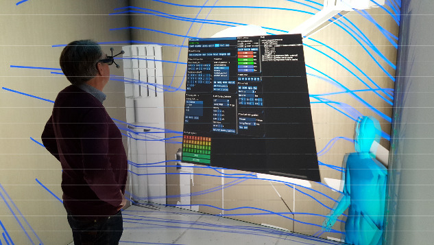
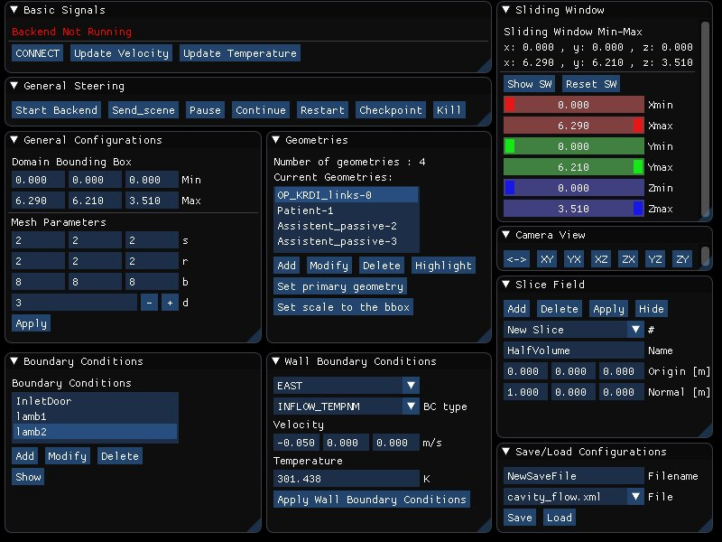
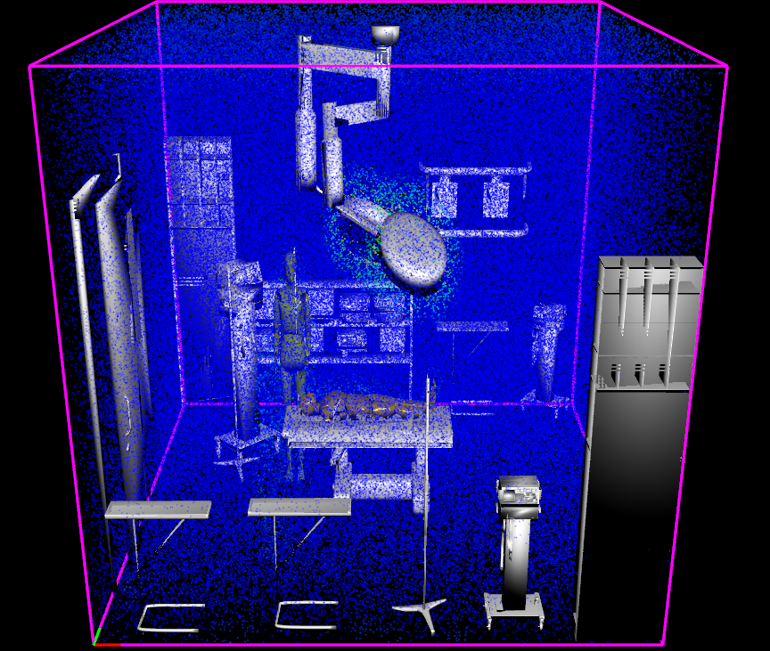

# mpFluid CAVE Front End

This code is a piece of code implemented during my master's thesis at TU Munich : 

*Interactive Exploration and Computational
Steering  in  CAVE-like  Environments  for
High-Performance Fluid Simulations*

[The thesis can be read here.](https://www.ugurcansari.com/pdf/MasterArbeit.pdf)

The code here is the part of the code written C++ using libraries such as
[ Magnum Graphics](https://magnum.graphics/),
[Boost](https://www.boost.org/) and
[DearImgui](https://github.com/ocornut/imgui).

__The current code will NOT be working due to the data structures as well as kernels at the back end which is an in house by the chair. Another missing part is the communication library which is also in house (for now). If anyone is interested in building this code, then you should mail to ugurcansari93@gmail.com__

_________________________________________________________

## Some images and screenshots:

